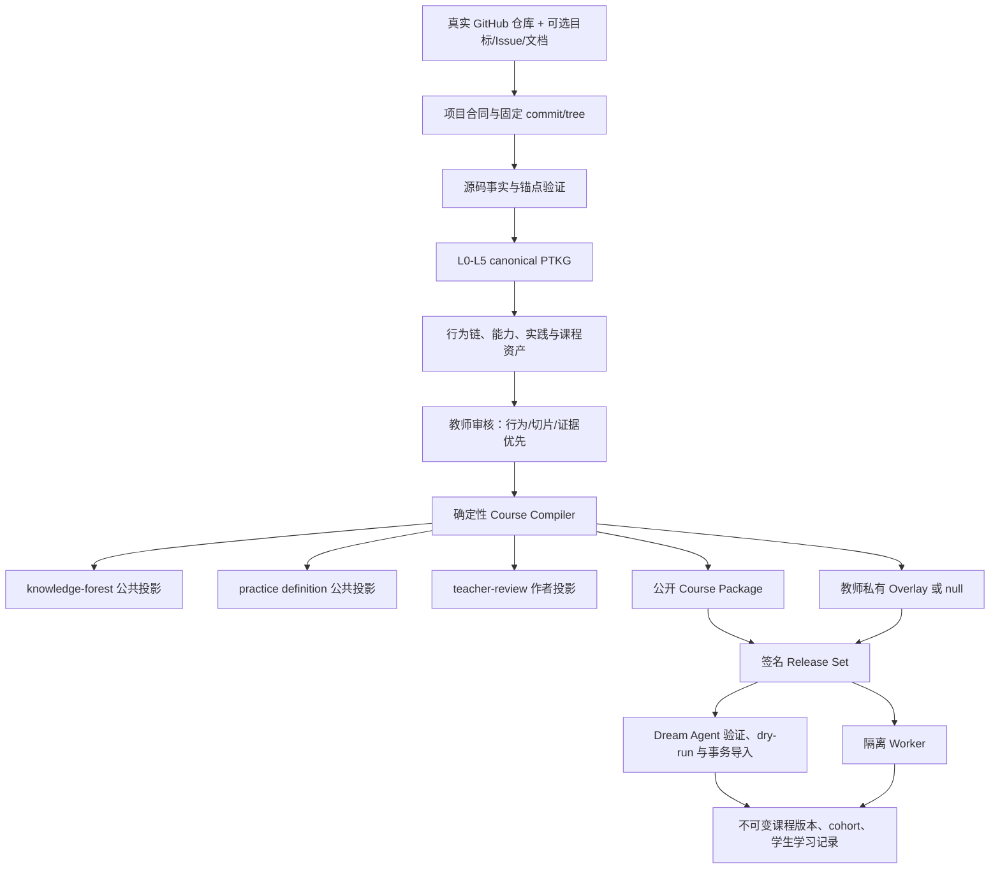

# 13 · 六项目融合后的最终课程编译器与训练营设计稿 v1.0

**日期**：2026-08-18  
**状态**：最终设计稿 v1.0；后续实现必须通过本文的功能准入门，不能以“参考项目里有”为理由直接加功能  
**适用范围**：PTKG 作者工具、Course Compiler、现有 `os-camp-course@1` 及其受控升级、Dream Agent 导入接口，以及后续教师端和学生端  
**上位边界**：完整项目自顶向下倒推，学生自底向上成长；课程止于 Project Readiness Gate，不分配真实项目工作，不评价个人上游贡献  
**研究依据**：[P20 决赛六个 OS 教学框架横向调研与融合建议](../调研/2026-08-18-P20决赛六个OS教学框架横向调研与融合建议.md)

---

## 1. 最终结论

六个项目不应被代码级拼接，也不应变成六套并列入口。正确的“融合”是：保留 PTKG 与签名 Course Package 作为唯一课程事实链，把六个项目中真正能改善学生学习的设计重新实现为统一契约、统一学习链和可删除重建的投影。

最终产品仍然是一件事：

> 教师给出一个真实 GitHub 仓库，以及可选目标、Issue 或工作文档，本地 Codex / Claude Code 按固定协议分阶段拆解，生成可审核、可签名、可直接导入训练营数据库的完整课程；学生沿真实代码完成从导学、基础到项目准备度的连续成长。

六项目对主线的最终贡献如下：

- EVOLVE 提供“同一真实仓库逐层成长”的课程骨架；
- AhRightOS 提供“细粒度实践合同、可信证据和证据门控提示”；
- Glenda 提供“规格、不变量、允许修改范围、测试和审计追踪”；
- 泰迦队提供“预测、真实运行、结构化事件、差异比较和反思”；
- 灵汐队提供“知识森林、渐进双面板、教师题组治理和个人状态覆盖层”；
- AI-OS 提供“低配置、弱网、离线可开始的短反馈入口”。

这些贡献并不等价于六项功能全部进入首版。首版只建设四个核心能力：

1. 固定真实源码上的连续学习；
2. 围绕可观察行为的完整实践；
3. 可信证据与失败后的定向补救；
4. 教师可审核、可签名、可导入、可回滚的课程发布。

知识森林、预测和回放会保留契约，但按需渐进开启；完整 IDE、复杂动效、桌宠、排行榜、多模型评分和深度个性化不进入当前主线。

---

## 2. 唯一北极星：学生能否迁移到未见过的真实任务

系统的北极星不是节点数、页面数、课程完成率、聊天轮数或 Agent 生成速度，而是：

> 学生面对一个没有见过、但与所学能力相邻的真实系统任务时，能否独立定位源码、说清行为与不变量、完成受控修改或调试，并用可信测试证明结果。

所有功能至少要改善下面一种可观察结果：

| 编号 | 学习结果 | 可接受的直接证据 |
|---|---|---|
| O1 | 找得到 | 能在固定仓库中定位入口、声明、调用路径和相关测试 |
| O2 | 说得清 | 能解释状态变化、错误路径、资源清理和关键不变量 |
| O3 | 改得动 | 能在允许范围内完成 fill、debug、trace、test 或 review 任务 |
| O4 | 验得真 | 能设计或运行正例、负例、并发和回归验证，并识别测试盲点 |
| O5 | 迁得走 | 能把已有能力迁移到相邻行为、另一代码位置或项目参考情境 |

课程基础设施本身不是学习效果。确定性编译、签名、导入和回滚非常必要，但它们证明的是课程可信、版本稳定，不等于学生已经学会。

---

## 3. 新功能准入制度

以后每个新功能在进入主线前必须填写一张“功能准入卡”，不得因为别的项目做过、界面好看或技术先进就直接加入。

### 3.1 功能准入卡

| 字段 | 必须回答的问题 |
|---|---|
| 学生问题 | 它解决学生的哪一种迷路、误解、实践失败或重复劳动？ |
| 学习假设 | 它预计改善 O1–O5 中的哪一项？为什么？ |
| 目标阶段 | 它应在哪个阶段出现，为什么不能更早或更晚？ |
| 最小实现 | 不建设完整平台时，最小可验证版本是什么？ |
| 对照基线 | 没有该功能时，学生使用什么更简单的流程？ |
| 观察证据 | 用什么行为数据、迁移任务或教师观察判断它有效？ |
| 学生代价 | 是否增加阅读量、点击、表单、等待或注意力切换？ |
| 教师代价 | 是否增加内容维护、审核、故障处理和版本迁移负担？ |
| 风险 | 是否引入安全、隐私、许可证、答案泄漏或事实漂移？ |
| 资源预算 | 开发、运行、磁盘和内存成本是多少，是否触发 30GB 审批线？ |
| 回退方案 | 删除该功能后，课程能否继续使用并从唯一事实源重建？ |

### 3.2 四项硬门与四类结论

功能只有同时满足下列硬门，才可以进入实现排序：

1. 明确对应 O1–O5 至少一项，而不是只提高“活跃度”；
2. 有最小版本、对照流程和可观察证据；
3. 不替学生完成核心代码，不削弱真实实践与可信证据；
4. 不创建第二课程事实源，不突破安全、隐私和许可证底线。

通过硬门后再按“学生影响范围 × 效果置信度 ÷ 认知、教师和工程成本”排序。该公式只帮助说明取舍，不自动替代教师判断。最终只有四种结论：

- `core`：没有它，真实学习闭环或可信发布无法成立；立即接入；
- `experiment`：可能有效，但要先在黄金单元做小范围对照；
- `defer`：有价值但当前收益不抵成本；保留接口，不进入排期；
- `reject`：违反学生主体性、证据、安全、治理或唯一事实源；明确拒绝。

任何 `experiment` 都必须可独立关闭。试点不能证明改善目标指标，或明显增加学生迷路、基础设施失败和教师负担时，应删除而不是继续美化。

---

## 4. 最终总体架构



唯一事实链分两个时刻理解：

- 作者阶段：固定源码、教师输入和 canonical PTKG 是权威候选事实；
- 发布阶段：教师签名的 Course Package 是不可变发布事实。

`knowledge-forest`、`practice-run`、`teacher-review`、Dream Agent 数据库、搜索索引、Neo4j 和前端页面都只是派生投影或导入快照。删除它们以后，必须能从固定输入和签名包重建等价结果。

六个外部教学项目只作为设计证据来源，不成为运行时依赖，也不把其仓库、分支、数据库和 UI 代码合入 PTKG。

---

## 5. 六项目设计的最终吸收矩阵

| 来源 | 真正解决的学生问题 | 最终吸收 | 必须改造 | 主线落点 | 不吸收的部分 |
|---|---|---|---|---|---|
| EVOLVE | 每课换玩具代码，学完仍接不上真实项目 | 同仓连续成长；`orient → read → run → debug → reflect → transfer` | 不写死 Lab1–8；用固定源码、稳定行为和累积证据；反思按关键节点触发 | 课程蓝图、源码递进边、黄金纵向课程 | 整仓复制变体、固定章节编号、完整 IDE 先行 |
| AhRightOS | 实践题面、检查、提示和证据彼此脱节 | Practice Contract、行为/不变量门、证据收据、分级提示 | PASS marker 降为辅助；二/三级提示绑定真实尝试或失败证据；公开包与教师私有材料分离 | practice-run、gate、补救链 | 无许可证素材、过早公开答案、仅凭 checker 输出通过 |
| Glenda | 学生会改代码但说不清边界、不变量和风险 | 规格—源码—测试—证据追踪；允许修改范围；错误路径 | Agent 只能辅助读、问、评审；不得替学生实现核心代码 | behavior、slice、typed assertion、review queue | 从空目录建 OS 的整套流程、Agent 代写实现 |
| 泰迦队 | OS 状态不可见，学生运行后不知道为何成功或失败 | 可选预测、关键事件、前后运行比较、因果反思 | 只记录断言和少量关键状态；事件必须来自真实运行；简单任务不强制预测/反思 | 高价值 debug 实践、practice run result | 全量 Trace 先行、marker 自证、分支式答案管理 |
| 灵汐队 | 学生看不到全局位置，教师难维护题组与图谱 | 局部知识森林、渐进双面板、题组版本、个人证据覆盖层 | Reviewer fail-closed；图谱只读可重建；掌握状态不写回公共图 | knowledge-forest、teacher-review、Dream Agent | Reviewer 失败放行、普通 Bash 伪沙箱、默认巨大力导图 |
| AI-OS | 新手、弱网和低配置学生启动成本高 | 短知识卡、少命令、快速反馈、只读离线导出 | 所有内容从 Course Package 自动生成；学习记录仍进正式运行时 | tutorial 兜底、离线 projection | Rust 常量作为课程源、查看页面即完成、无证据进度 |

结论不是“六取六”，而是把六个项目分别放在最擅长的位置，并对每个缺陷做约束。任何外部项目中的自报规模、测试数和学习效果都不能替代我们的独立验收。

---

## 6. 学生课程的基本单位：完整行为回合，不是知识碎片

知识图可以很细，学生课程不能把每个节点机械变成一节碎课。一个学生单元必须围绕一个可观察行为形成完整回合：

```text
看见项目全景和当前位置
→ 在固定仓库定位真实入口
→ 复现一个最小真实行为
→ 补充为解释当前行为所需的知识
→ 可选预测关键结果
→ 做受控修改、调试、追踪、测试或评审
→ 用行为/状态断言验证
→ 对关键差异做因果解释
→ 说明迁移用途；在 task class、阶段出口或 Readiness Gate 完成未见迁移
```

微 Lab 是完整回合中的练习、故障隔离或补救包装，不是课程组织根。禁止为了“课程丰富”把一条行为链切成十几道互不相连的小题。

每个学生可见的 episode 固定检查八个槽位：

1. `where/why`：当前位置和项目用途；
2. 一个主要可观察行为；
3. 固定源码身份和真实锚点；
4. 本单元最多一个主要修改范围；
5. 恰时知识与典型误区；
6. 一种主实践变体；
7. 适用的断言和证据层级；
8. 下一步以及回到完整项目的位置。

一个 episode 可以拆成若干 20–40 分钟步骤，完整回合初始目标为约 90–180 分钟；补救目标为 10–30 分钟。它们只是试点用的初始设计值，必须根据真实学生反馈调整，不能写成固定教学规律。

“节点只学一次”也需要纠正为：

> 知识与能力节点只定义一次，但会在多个阶段、多个实践和多个项目中反复调用，并逐步增加更强的证据。

导学阶段证明“做过一次真实动作”，基础阶段证明“能解释和受控操作”，项目先导阶段再证明“能调试、验证和迁移”。旧证据可以满足低层前置，但不能永久替代更高强度证据。

---

## 7. 四阶段学生体验

| 阶段 | 学生看到什么 | 学生主要做什么 | 证据强度 | UI 复杂度 |
|---|---|---|---|---|
| `tutorial` | 项目小地图、固定版本、当前一步、只读源码 | clone/定位/构建/运行/观察/保存第一份真实证据 | 真实动作，低风险 | 单主面板，最少命令 |
| `foundation` | 当前行为链、知识卡、源码与运行环境 | 阅读调用链、fill/trace、错误处理、负例和回归 | 解释 + 代码 + 测试 | 按需开启双面板 |
| `pre_project` | 跨模块路径、局部知识网、证据时间线 | debug、并发/资源生命周期、故障注入、设计 review、迁移 | 高保真工程证据 | 开放比较和局部回放 |
| `project_reference` | 完整项目地图、实现状态和准备度报告 | 重建项目边界、连接公共能力、识别 present/partial/absent 风险 | 项目迁移证据 | 全景可展开，不分配项目任务 |

学生始终能在 30 秒内回答三个问题：

1. 我现在在哪里；
2. 为什么学这一项，它在完整项目哪里使用；
3. 下一步做什么，失败后去哪里补。

默认只展示当前一步和到项目根的上溯路径，不默认展开数百节点。完整森林是主动展开的全景工具，不是新手首页。

`reuse_count` 和 `dependency_depth` 只能提出阶段候选，不能自动决定排课。阶段还要考虑学生入口、前置深度、内在复杂度、源码成熟度、执行成本和安全风险，并由教师确认；同时使用经典 OS 能力清单做覆盖审计，避免课程被单一项目当前目录结构绑架。

---

## 8. 失败—补救—重试闭环

定向补救是首版核心，不是后续推荐算法。系统先区分失败性质，再决定学习动作：

| 失败类型 | 系统处理 | 是否计为学生能力失败 |
|---|---|---|
| 环境/Worker/工具链故障 | 给环境诊断或转人工；保持 `infrastructure_error` | 否 |
| 概念误解 | 返回最相关知识卡和一至两道诊断题 | 是，但不终结本次路径 |
| 不会定位源码 | 给出仓库导航、声明定位或调用链阅读任务 | 是 |
| 实现错误 | 展示具体失败断言，按方向→范围→不变量→伪代码逐层解锁提示 | 是 |
| 并发/回归错误 | 进入相应时序、资源清理、负例或回归补救 | 是 |
| 证据不足 | 要求补运行、解释或迁移，不把聊天和自评升级为掌握 | 待定 |

补救完成后回到同一个真实实践重试，不另造一套与最终项目脱节的玩具答案。系统记录使用过的提示层级，并在后续安排一次较少脚手架的迁移任务；提示不是惩罚项，也不能直接等同于未掌握。

提示采用三级策略：一级只给不剧透的方向，新手可以直接使用；二级给定位或失败范围，需要至少一次真实尝试；三级接近解法，只在存在对应失败证据或教师策略允许时解锁。证据门不能反过来把第一次遇到环境或工具问题的新手困住。

个人状态首版只使用可解释状态：

```text
未开始 → 已尝试 → 当前情境已验证 → 相邻迁移已验证
```

另加 `使用过提示 / 证据已过期 / 需要复查` 标记。暂不使用一个看似精确的“掌握度百分比”，也不使用只升不降的永久高水位。

---

## 9. Practice Contract 最终设计

每个必修实践都由一个结构化合同驱动。字段按 `observe | trace | fill | debug | test | review` profile 条件必填，不要求观察型任务伪造 patch 或并发断言。

| 分组 | 核心内容 |
|---|---|
| 身份 | practice、unit、behavior、slice、course version、稳定 external ID |
| 源码 | source contract、commit/tree、验证过的 blob/path/symbol/snippet、源码保真度 |
| 学习动作 | variant、学生责任、已提供脚手架、明确隐藏内容 |
| 修改边界 | allowed file/symbol/range/glob、forbidden scope、实际 diff/patch hash |
| 验证 | 带稳定 ID 的正例、负例、并发、回归、seeded-fault assertion；oracle 和 N/A 理由 |
| 运行 | 受信命令、环境 digest、限额、超时、reset、artifact 引用 |
| 教学 | 可选预测、分级提示、提示解锁证据、失败到补救的映射 |
| 治理 | 风险、review event、audience/visibility、content hash、发布要求 |

对早期字段建议做以下修正：

- `same_final_source` 不允许 Agent 手填布尔值；改为 `source_continuity: exact | same_repo_new_ref | patch_overlay | high_fidelity_fixture | reference_only`；其中前三类可由 Git/patch/anchor 证明，`high_fidelity_fixture` 是教师审核结论，不能由 Agent 纯自动推导；
- `source_progression` 不写自由文本，使用前后 unit/slice 的稳定边，说明脚手架增加、撤除和证据升级；
- `allowed_change_scope` 必须结构化，Worker 用实际 diff 验证；
- `before_hash / after_hash / patch_hash` 只属于修改型 variant artifact；
- `negative_assertions` 升级为有 ID、oracle 和证据源的 typed assertion；
- `hint_requires_evidence` 升级为规则对象，例如“至少一次真实尝试 + 指定失败断言”；
- `teacher_review_required` 由风险规则自动向上提升，Agent 只能加严，不能降级；
- `visibility` 只控制展示，不能承担保密。参考答案和隐藏测试不得进入学生可下载包。

### 9.1 三种证据必须分开

1. **发布证据**：教师证明实践在固定环境可完成、测试能识别错误；
2. **学生尝试证据**：证明学生确实运行、修改或分析过，但不自动等于掌握；
3. **掌握证据**：行为通过，再加因果解释或相邻迁移任务。

公开 Course Package 保存实践定义和可公开发布收据；学生 prediction/run/evidence 进入 Dream Agent 学习记录；教师参考 patch、隐藏 assertion 和敏感答案进入受控教师私有 overlay。

三种证据使用统一 `Evidence Envelope`，至少包含：

```text
purpose: release | attempt | mastery
producer / authority / trust_root
course_version / release_set_root
source_contract / commit / tree
practice / assertion / object content hashes
status / artifacts / created_at
invalidated_by / expires_at
```

Gate Policy 引用具体 evidence IDs、允许的 purpose/producer、所需 assertion、trust root 和有效期，不再读取模糊布尔值。`infrastructure_error` 使 mastery 保持 `pending`，既不能 pass 也不能 fail 学生；教师例外只能临时解锁学习路径，不能伪造掌握或发布证据。确定性题和测试可自动裁决，LLM 只能生成候选，高影响 Readiness 由受信规则与教师终裁。

`tutorial/foundation/pre_project` 的必修修改型实践在发布前必须拥有成功的 release receipt；`project_reference` 可以诚实保留 partial/unresolved，但不能替代 executable gate 的发布证据。

教师私有 overlay 不能独立编写或改变课程评价语义。它必须与公开包由同一次 canonical 编译确定性生成，并共同组成一个不可变 `os-camp-release-set@1`。Release Set 至少绑定 `course_id/version`、`public_package_root`、`teacher_overlay_root | null`、各 Schema 版本、source composition root、trust policy 和教师签名。overlay 内容变化必须创建新课程/评价版本，已有 cohort 继续固定旧版；学生至少能看到行为、不变量、判定类别和通过原则，隐藏的只能是具体样例、参考补丁与答案。

Dream Agent 的 `CourseVersion` 和 cohort 同时固定 release-set root、公开包 root 和 overlay root。Worker 只消费通过信任校验的 Release Set；声明需要私有 assertion 的实践若 overlay 缺失、root 不符或签名不可信，必须阻止激活和执行，不得降级放行。参考 patch 永远不挂载进学生可访问的 worktree/容器；隐藏判断尽量在宿主受信 harness 一侧完成，输出只暴露学生理解失败所需的最小信息。

Gate 不再只保存一个 `trusted_evidence=true` 布尔值，而要引用具体 assertion/evidence IDs、可信提供者和判断策略。受信测试 harness、隐藏 assertion 和参考 patch 必须位于学生禁止修改范围；判别力以“未修改基线呈现预期初始状态、受信参考 patch 后通过、seeded fault 后指定 typed assertion 失败、reset 后恢复”为准，任何文本 marker 都只能是调试信息。

---

## 10. 两套源码合同之间的显式迁移桥

D8 已决定公共可执行主干和 cgroup 项目参考使用不同源码合同：

```text
starryos_merged_baseline
→ 已合并、可执行的导学/基础/项目先导实践

cgroup_project_reference
→ 固定 cgroup 项目地图、源码事实与边界审计
```

因此不能笼统宣传“从导学到 cgroup 全程是同一个 commit”。正确设计是：

1. 在同一 `starryos_merged_baseline` 内，6–10 个累计单元保持真实源码连续；
2. 进入 `project_reference` 时增加 `source_bridge`；
3. `source_bridge` 显示两份 source contract、对应 canonical 能力、锚点映射、行为相同点、实现差异和不可继承的证据；
4. 公共基线的执行证据只能证明公共能力，不能自动证明 cgroup 参考分支行为；
5. cgroup reference 的 partial/absent 内容只能做设计和边界审核，不能借公共证据冒充端到端生效。

公共必修 executable practice 只允许使用 merged baseline 的 `source_continuity=exact`，或在同一固定基线上的受控 `patch_overlay`，且实现状态必须为 `present`。`high_fidelity_fixture` 只可用于脚手架或补救，`reference_only` 只能形成设计、阅读和迁移证据；`same_repo_new_ref` 必须先过 source bridge 和证据失效审核。

`source_bridge@1` 是一等、hash 化且需要教师高风险审核的 canonical object，至少包含：

```text
from_source_contract_root / to_source_contract_root
canonical_capability_id
from_binding_and_anchors / to_binding_and_anchors
relation: exact | analogous | diverged | unknown
known_differences
inheritable_evidence_kinds / forbidden_inheritance
review_event_id / content_hash
```

两份源码不塞进同一个未隔离作者 run。`starryos_merged_baseline` 与 `cgroup_project_reference` 分别在独立 authoring workspace 固定和校验，再由确定性 `composition-manifest@1` 列出两个 workspace/projection roots、source contracts 和 bridges。编译器只消费这些 root，不允许无 hash 复制另一工作区事实。

课程包需要显式的 `source_contracts[]` 与 `bridges[]`。execution、navigation、diff 和 runtime evidence 默认跨 source contract 一律不继承；概念证据也只有在 exact canonical identity 且教师批准时才能满足低风险前置。source bridge 本身必须生成目标源码上的迁移任务，不能自动通过 gate。

这既保留 EVOLVE 式同源连续性，也诚实处理真实项目中已合并基线与未合并参考实现不同的事实。

---

## 11. 四类可重建投影

### 11.1 `knowledge-forest`

用途是让学生和教师看见项目、成果、工作包、能力、实践、知识、证据与来源的关系。首版契约包含：

- course/version/package hash；
- 项目、阶段、子树和当前节点筛选；
- node type、stage layer、dependency depth、origin projects、reuse count；
- 硬前置、组成、实现、证据、考核和普通关联边；
- 固定源码引用、unresolved/conflict/expired 标记；
- 默认折叠深度和“当前节点到项目根”的定位路径。

课程结构与学生状态分离。学生状态由 Dream Agent 按 `student + courseVersion + node` 动态覆盖，不写回公共图。

### 11.2 `practice-run`

分为发布时的 Practice Definition 与学生的 Run Record。公开包和公共 projection 只包含 Practice/Assertion Definition；prediction、Run Record、stdout、diff、artifact 和个人证据只进入 Dream Agent 运行数据，绝不能被编译回公共包。

`AssertionDefinition` 与 `AssertionResult` 必须分开：Definition 定义 assertion ID/content hash、类别、可见行为或不变量、oracle 类型、适用 profile 和受信 producer；Result 记录某次固定运行的裁决。Run Record 至少记录：

- course version、practice、attempt、source 和环境身份；
- 可选的运行前预测及其原始文本；
- 逐条 typed assertion 结果和失败归因；
- 受限 stdout/stderr 摘要与 hash；
- 关键事件、artifact、reset 和实际 diff 证据；
- `passed | failed | unresolved | infrastructure_error`；
- 前后运行比较与可用的回放定位。

失败原因另分为 `student_error | test_failure | toolchain_failure | worker_failure` 等可操作类别；状态和原因不能揉成一个“失败”。

每条 Assertion Result 的状态为 `passed | failed | not_run | not_applicable | infrastructure_error`，并绑定：

```text
release/public/overlay roots
practice/assertion content hashes
source commit/tree + student diff/patch hash
image/environment + harness/test hash
run purpose + attempt ID
artifact hashes + reset evidence
```

Worker 的运行目的严格分为 `release_validation` 与 `student_attempt`，两者不得复用一份结果冒充另一类证据。`fault_probe` 属于教师发布时验证测试判别力的证据，不是每名学生每次都要执行的普通 assertion。

只有受信、hash 固定且不在学生 allowed scope 内的 harness 能形成执行结论。guest/stdout marker 只能是 oracle 的观测输入，不能直接成为 oracle；前端按钮、AI 回复、学生自评和可伪造 marker 都不能改变 gate 状态。Worker 还要验证 base blob/symbol、symlink/path escape、实际 diff、forbidden scope，以及 harness/overlay 未被修改。

### 11.3 `teacher-review`

它是作者工作区/教师端的治理投影，不进入学生可下载的公开 release 包，也不携带到运行时作为待决课程内容。公开包最多保存已经批准的 review-event 摘要、对象 hash 和签名承诺。

审核队列固定为：

1. 行为链、代码切片、源码证据和 gate；
2. 低风险措辞、标签、排序和元数据；
3. 冲突、疑似重复、高影响前置边、重绑候选、隐私和许可证问题。

每项显示 stable ID、content hash、Agent/checkpoint、风险、源码证据、上下游关系、变更 diff 和 findings。教师动作生成不可变 review event；对象内容变化后原审批自动失效。

教师例外必须记录范围、理由和期限；固定源码身份、签名信任、隐私、许可证、路径安全和学生核心责任属于不可豁免底线。

### 11.4 Dream Agent `CourseRepository`

Dream Agent 只消费验证通过的 Release Set，负责不可变课程版本、cohort 固定、学生记录、版本激活和回滚。它不读取 PTKG 临时工作区，也不允许网页、数据库或图引擎反向静默修改发布课程。

当前 `os-camp-course@1` 使用严格 Schema，新增的是必需语义而非可忽略展示字段，因此不能一边增加 required 对象一边声称完全兼容。F1 正式定义 `os-camp-course@2`：

- `@1` 课程、导入器和历史 CourseVersion 只读保留；
- Dream Agent 在一个兼容周期内同时读取 `@1/@2`；
- 新融合课程只以 `@2 + os-camp-release-set@1` 发布；
- 提供确定性 `@1 → @2` 迁移器，但缺失的新语义保持 candidate/unresolved，绝不自动伪造；
- `@1` 不得宣称具备本设计的私有 overlay、typed assertion、source bridge 或新 evidence policy。

### 11.5 Canonical object 与可见性布局

| 对象 | 作者阶段 canonical 路径 | 公开 `os-camp-course@2` | 私有/运行位置 |
|---|---|---|---|
| Practice Definition | 复用现有 `09-course/practices.jsonl`，按 `@2` Schema 升级 | `course/practices.jsonl` | — |
| Public Assertion Definition | `09-course/assertion-definitions.jsonl` | `course/assertions.jsonl` | — |
| Source Bridge | `09-course/source-bridges.jsonl` | `course/source-bridges.jsonl` | — |
| Remediation | `09-course/remediations.jsonl` | `course/remediations.jsonl` | — |
| Public release receipt | `06-evidence/release-receipts.jsonl` | `governance/release-receipts.jsonl` | 敏感 artifact 只存 hash/受控引用 |
| Knowledge Forest | 编译器确定性生成 | `projections/knowledge-forest-v1.json` | 学生状态在 DB 覆盖 |
| Practice Definition projection | 编译器确定性生成 | `projections/practice-definition-v1.json` | — |
| Teacher review queue | `.ptkg/review/teacher-review-v1.jsonl` | 不打包；只带已批准 event 摘要/hash | 教师工作台 |
| Hidden assertion/harness | `.ptkg/private/teacher-overlay/` | 不打包，只提交 root/ID | `os-camp-teacher-overlay@1`，宿主受信侧 |
| Reference patch/answer | `.ptkg/private/teacher-overlay/` | 不打包，只提交 root/ID | overlay；永不挂载给学生 |
| Prediction/Run/Assertion Result | 不属于课程定义 | 不打包 | Dream Agent 按 student/attempt/courseVersion 保存 |

公开包继续包含 `projections/dream-agent-v1.json` 或其 `@2` 后继投影。所有公开文件和 release-set manifest 都进入 checksum、确定性排序、路径安全、隐私与信任校验；教师 review queue、学生运行数据和私有答案绝不混入公开包。

---

## 12. 最小学生界面设计

首版学生端不是完整在线 IDE，而是一条减少迷路和反馈延迟的学习工作台：

```text
课程版本 / 项目位置 / 当前单元 / 当前证据状态

主区域 A：任务｜知识｜分级提示
主区域 B：真实源码｜受控运行环境（按阶段解锁）
折叠区：断言结果｜证据时间线｜关键反思
```

设计规则：

- 教程阶段默认单面板，一次只显示一个动作；
- 基础阶段才开放源码/终端双面板；长期并排不超过两个主区域；
- 项目先导开放跨文件追踪、前后运行比较和局部知识网；
- 完整森林默认折叠，只显示当前子树和上溯路径；
- 结构层级与个人状态不能只靠红绿颜色编码；
- 预测只用于存在典型误解或多种合理结果的关键运行；不计分；
- 反思只在预测与结果冲突、关键 gate 或迁移任务后要求，避免表单疲劳；
- Trace 首版只展示断言事件和少量关键状态，不把教学动画冒充真实运行；
- 离线模式只做由 Course Package 自动生成的只读导出，不维护第二份正文。

体验底线还包括：小屏自动退化为单面板；支持键盘、屏幕阅读、非颜色状态和减少动态效果；证据收据默认只显示结论与下一步，技术明细折叠；Worker 不可用时允许继续阅读、定位和预测，但 gate 保持 `unresolved`；网页故障时提供 CLI/manual 逃生路径。页面重新进入后应恢复源码位置、运行记录、提示层级和失败断言。

首版学生端刚需只有：当前位置、下一步、真实源码、受控实践、逐断言反馈、证据收据、定向补救、分级提示和可解释证据状态。

---

## 13. 多 Agent 与多项目并行的正确方式

多 Agent 用于加快候选内容生产，不能把课程权力拆散，也不能让多个 Agent 同时写 canonical workspace。

### 13.1 单项目内部并行

继续使用已经实现的 M1 协议：

```text
单协调者冻结项目合同、commit/tree 和 L0-L2
→ task-split 按行为连通覆盖组或课程单元分片
→ Agent 只读固定 input/context.json
→ Agent 只写隔离 output/
→ author-seal
→ author-merge dry-run
→ 冲突、越权、过期和 hash 不符拒绝
→ 原子写入 canonical workspace
→ 全量规则校验与教师审核
```

建议角色分工：

- 协调者：项目合同、全局图谱、源码身份、跨单元边、Readiness Gate 和最终合并；
- 实践 Agent：按行为连通组生成能力、切片、assertion 和补救候选；
- 课程资产 Agent：按 unit 生成知识卡、双题组和 practice 候选；
- 学习体验审计 Agent：只读评估认知负担、迷路点和功能准入，不写课程事实；
- 教师：审核高风险事实、行为链、切片、证据、冲突和发布签名。

源码事实、全局蓝图、Readiness Gate、教师权力和高资源 Worker 当前保持串行。只有 M2 完成 path/symbol ownership 后，才开放源码理解并行。

### 13.2 多个真实课程项目并行

每个 GitHub 项目使用独立作者工作区和独立固定源码合同，共享一个只读 canonical knowledge snapshot。森林合成器只在输出端做：

- exact canonical ID + 相同目标/前置/证据：自动复用；
- 相似：生成疑似重复候选；
- 语义更窄或更强：生成 `specializes/extends` 候选；
- 内容相反或版本冲突：生成 `conflicts` 候选；
- 任何候选关系都不能自动改变已有发布课程。

六个 P20 教学框架本轮是“设计参考项目”，不是六门要导入的课程。未来真正的多项目森林应使用 StarryOS cgroup、Linux ABI/syscall、组件化重构、rCore 等真实课程项目验证。

---

## 14. 首个黄金纵向课程

首版不依赖未完全跑通的 cgroup specialization。教师确认 `starryos_merged_baseline` 后，再从 code facts 中选择一条已合并、可稳定运行、又能迁移到 cgroup 的纵向能力。不得先按“进程、VFS、内存各做一课”凑目录，也不得在固定源码核验前凭项目名预选 symbol。

候选行为必须同时满足：真实可观察；跨 2–3 个子系统；存在安全的小修改范围；能设计正例、负例以及至少一种高价值回归或故障；不依赖特殊硬件；能自然展开 6–10 个累计单元。进程生命周期可以作为待核实候选，但不是本文冻结的最终选择。

建议只做 8 个累计单元：

| 单元 | 阶段 | 核心学习动作 | 关键证据 |
|---|---|---|---|
| U1 | tutorial | 看项目全景、引用课程固定版本、定位相关模块；commit/tree 真值由工具验证 | 固定源码与定位收据 |
| U2 | tutorial | 构建、启动并复现最小行为 | 真实命令、环境和日志 |
| U3 | foundation | 追踪入口、声明、状态读写和调用链 | 源码锚点与行为图 |
| U4 | foundation | 解释成功、失败、清理和不变量 | 状态表与错误路径评审 |
| U5 | foundation | 完成一个受控 fill/trace 变体 | diff、正例与回归 |
| U6 | foundation | 修复一个可判别 debug 变体 | 负例、失败断言、reset |
| U7 | pre_project | 做相邻迁移；共享状态存在时加入并发，否则说明 N/A | 迁移任务与四类证据矩阵 |
| U8 | project_reference | 经 source bridge 把能力映射到完整 cgroup 项目地图 | 实现边界、风险和 Readiness Gate 报告 |

每个单元仍有知识卡、诊断/补救题、checkpoint 题、实践和 gate 贡献，但这些资产围绕行为回合服务，不能反过来把行为拆散。双题组是可抽取的题池，不要求学生做完池中所有题。

只为 U6 这类高价值 debug 单元首轮试验“预测 + 关键事件 + 前后比较”。如果它不能改善因果解释、补救重试或迁移表现，就不扩展到全部课程。

这 8 个单元是新增的 `starryos_merged_baseline` 纵向黄金样例，不替换 D8 已冻结的 16 个 cgroup 候选单元。原 16 单元继续按 D8 分成公共能力重绑、`project_reference` 和 cgroup specialization，旧课程版本只读保留。

---

## 15. 当前主线匹配度与真实缺口

| 主线能力 | 当前状态 | 与最终设计的关系 |
|---|---|---|
| 固定 commit/tree、源码锚点、hash 与状态诚实性 | 已有 | 可直接复用，不重做 |
| L0-L5 PTKG、行为链、学习切片 | 已有 | 继续作为 canonical 主干 |
| 确定性 `os-camp-course@1`、质量规则、签名 | 已有 | 是现有发布基础设施；历史包保留 |
| Dream Agent 事务导入、版本、cohort、回滚 | 已有 | 需扩展为同时固定 Release Set/public/overlay roots |
| M1 多 Agent 隔离、封存、冲突检测和合并 | 已有 | 可立即并行生产能力/课程资产候选 |
| `knowledge-forest` / `practice-run` / `teacher-review` 独立投影 | 缺 | 下一轮首要契约任务 |
| 结构化修改范围、typed assertion、提示门、失败归因 | 部分 | Practice Contract 的关键补强 |
| 公开包与教师私有 overlay 隔离 | 缺 | 防答案泄漏和可信发布所必需 |
| `os-camp-course@2` 与签名 Release Set | 缺 | 承载新 required 语义，不静默扩展严格的 `@1` |
| `source_bridge` 与跨基线证据边界 | 缺 | D8 双源码合同必须补齐 |
| 一个已合并 StarryOS 纵向课程的真实学生闭环 | 缺 | 判断融合设计是否有效的黄金样例 |
| 最小教师/学生界面 | 未做，符合原计划 | 等投影契约与黄金课程稳定后建设 |
| cgroup S0/S2/S3 正式执行 | unresolved | 只影响 cgroup specialization，不阻塞公共黄金课程 |

因此，当前主干不是“不能用”，而是已经具备可靠课程生产与导入底座，尚缺把课程真正变成优质学生学习体验的实践合同、补救链和投影接口。下一步不需要换平台或推倒重写。

---

## 16. 功能四级清单

### 16.1 立即接入 `core`

- 固定真实源码、稳定锚点与显式 source bridge；
- 同仓累计单元和结构化 source progression；
- 完整 Practice Contract 与结构化修改边界；
- 行为/状态级 typed assertion；
- 失败归因、定向补救和证据门控提示；
- 发布、尝试、掌握三类证据分离；
- Evidence Envelope、Gate Policy 与签名 Release Set；
- 教师审核队列、hash 失效、签名和回滚；
- 三个可重建投影契约；
- 学生当前位置、下一步和基础证据状态的数据契约/API；F1 不提前建设页面；
- 公开 Course Package 与教师私有 overlay 分离，并由一个发布身份共同钉死。

### 16.2 小范围试验 `experiment`

- 关键 debug 单元的运行前预测；
- 少量真实事件、前后运行比较和局部回放；
- 基础阶段逐步解锁的双面板；
- 只读离线导出；
- 基于 core 证据状态的轻量路径建议；不把推荐算法混入基础状态；
- 教师题组版本化与低风险批量审核。

### 16.3 暂缓 `defer`

- 默认全展开的多项目知识森林；
- 完整浏览器 IDE、三栏以上长期并排；
- 全量 QEMU 寄存器/内存 Trace 与回放；
- 深度个性化推荐和概率掌握模型；
- 多模型自动评分、自动进化 Agent；
- 公网多租户执行环境；
- Dify/Langflow/Coze 平台对照；
- 多语言深度分析器扩展；
- 桌宠、动效、复杂成就和主题系统。

### 16.4 明确拒绝 `reject`

- 直接合并六个外部仓库或复制无明确许可证的源码、题库、UI、图片和课程正文；
- AI 替学生完成核心代码，再把结果记为学生能力；
- 公开 solution 分支作为默认学习路径；
- 只打印 PASS、只看退出码、点击完成、聊天或自评即通过；
- Reviewer/LLM/Worker 失败后自动放行；
- 普通 Bash 黑名单冒充沙箱；
- 基础设施故障算学生失败或算课程通过；
- Neo4j、数据库、localStorage 或前端常量成为另一事实源；
- 发布后原地修改内容并静默影响已有 cohort；
- 排行榜、刷题量和连续打卡替代深度学习；
- 为了图好看自动补不存在的语义边或隐藏 unresolved。

---

## 17. 学习效果与产品体验验收

### 17.1 核心指标

- 首次真实构建/运行所需时间；
- 在固定仓库定位目标声明和调用链所需时间；
- seeded/planted fault 识别率；
- 一次定向补救后的同任务重试成功率；
- 不看答案完成相邻迁移任务的比例；
- 学生因果解释在运行前后的改进；
- 提示使用层级和延迟复测表现；
- 基础设施错误率、页面切换次数、迷路回退次数和反馈等待时间；
- 系统判为“已验证”但教师迁移检查失败的假阳性率；
- 教师每单元审核、纠错和维护耗时。
- 每个 episode 的 1–7 级主观认知努力，以及学生是否知道下一步；
- 代表性失败中在两级提示内恢复的比例。

O2 的因果解释和 O5 的迁移必须预先冻结人工可核查量规，包括未见任务、行为、不变量、错误路径、证据要点和提示预算。LLM 只能生成评分候选，教师需要抽查或盲评；AI 帮助程度随证据记录。

### 17.2 三层试点

1. **技术冒烟**：一名开发者/教师走通，验证命令、权限、reset 和数据接口；不能据此声称学习有效；
2. **可用性试点**：至少 3–5 名基础不同的学生，观察迷路、反馈、补救和认知负担；
3. **学习效果试点**：有简单流程作为对照，用未见迁移任务比较，而不是只看满意度和完成率。样本不足时只报告方向性观察，不写“已证明提升”。

每次只引入一个高成本实验功能。若目标指标没有改善，或核心迁移结果下降、教师负担和基础设施故障明显上升，就回退到更简单版本。

首轮可用性试点采用以下目标值，但只能作为产品校准线，不得在小样本下宣传为统计显著的教学结论。3–5 人试点优先报告原始人数，不用百分比制造精确感：

- 除最多一名学生外，均能在不由观察者指出界面入口的情况下找到“现在做什么、在完整项目哪里、为什么、下一步是什么”；合理求助能力另行观察，不把少提问当成优秀；
- 环境准备完成后，15–20 分钟内获得第一次可执行反馈，首次完整可观察真实行为的中位时间不超过 45 分钟；安装和下载耗时单独统计；
- 所有 source contract/ref 切换 100% 提供迁移说明；
- 代表性 seeded fault 的拒绝率为 100%，文本 marker 不影响断言结果；
- 学习失败与基础设施失败 100% 分离；
- 代表性失败中，目标至少 80% 学生能在两级提示内恢复；小样本仍报告原始人数；
- 核心能力至少在两个情境中调用，并在后续单元或至少 7 天后安排轻量复核；
- 每个 20–40 分钟步骤都有可保存、可恢复的小检查点。

---

## 18. 分阶段实施路线

| 阶段 | 主要交付 | 退出标准 | 回退与资源纪律 |
|---|---|---|---|
| F0 设计冻结 | 本文、功能准入卡、四级清单 | 教学、证据、UI 三类审计一致 | 已完成；纯文档 |
| F1 契约补强 | Practice Contract、typed assertions、Evidence Envelope、source bridge、三投影、`@2`、教师 overlay 与 Release Set | Schema、确定性编译、路径/隐私/篡改/overlay 替换测试全绿 | `@1` 只读保留，新增 `@2`；低资源 |
| F2 黄金纵向课 | 已合并 StarryOS 8 单元 | 固定源码、逐单元可完成、补救可回原实践、至少一项 fault 被拒绝 | 不依赖 cgroup specialization；复用缓存 |
| F3 发布兼容 | `@1/@2` 双读、Release Set 验证、dry-run、导入、激活、回滚 | 删除投影/DB 后可重建；public/overlay 任一变化均形成新版；同版本异 root 拒绝 | 复用现有 G2–G4 能力 |
| F4 可信运行闭环 | 一个 debug 实践的 typed assertions、seeded fault、reset；预测/关键事件先走 CLI | 真实 Worker 发布证据、基础设施失败隔离、marker 不可伪造通过 | 单任务串行；超过 30GB 先请示 |
| F5 最小教师端 | 三类 review queue、diff、证据和签名入口 | 教师不直接改数据库，审核事件可重放 | 主干接口完成后再做；技术栈可替换 |
| F6 最小学生端 | 定位条、单/双面板、断言反馈、补救链、证据状态；一个单元按需显示预测/比较 | 3–5 名学生可用性试点完成 | 不做完整 IDE/大森林 |
| F7 多项目森林 | 多课程 exact reuse、冲突治理、个人覆盖层 | 公共知识只定义一次，项目差异可追溯 | Dify/图数据库仍只是可替换壳 |

每个阶段都要完成：实现、测试、README/STATUS、当天日志、独立提交和 CI。任何阶段不得为了赶 UI 跳过固定源码、实践判别力、教师签名和版本隔离。

---

## 19. 首版完成定义

“第一版完整课程体系”必须同时满足：

1. 教师确认 `starryos_merged_baseline` 的 40 位 commit/tree；
2. 从 GitHub 仓库和可选文档可生成可审核 PTKG 与 8 单元黄金课程；
3. 导学、基础、项目先导、项目参考四阶段连续，存在显式 source bridge；
4. 每个必修单元围绕完整行为回合，具有知识卡、双题组、实践、来源和 gate 贡献；
5. 修改型实践具备结构化边界、typed assertions、reset 和可信发布证据；
6. 打印 marker、点击完成、AI 自评和基础设施故障都不能通过 gate；
7. 失败能定位到断言、行为、知识和补救，并回到同一实践重试；
8. 三类投影可由 canonical PTKG 确定性重建；
9. `os-camp-course@2 + teacher overlay|null + os-camp-release-set@1` 可共同签名、dry-run、事务导入、激活和无损回滚；
10. 至少完成一次技术冒烟和 3–5 名学生可用性试点；
11. 完整 cgroup 项目地图存在，partial/absent/unresolved 未被冒充为已生效；
12. 学生路径止于 Project Readiness Gate，不产生项目分工、贡献排名或虚假 PR 要求。

---

## 20. 当前需要教师决定与暂不需要决定的事项

当前唯一必须由教师确认的执行输入仍是：

- `starryos_merged_baseline` 的固定 40 位 commit/tree。

本文不新增前端、工作流平台或图数据库选型决定。以下事项等黄金课程和试点数据后再讨论：

- 完整知识森林默认展开程度；
- 预测/回放是否扩展到更多单元；
- 离线导出是否进入正式发布；
- 个人路径推荐采用何种模型；
- Dify、Langflow、Coze 是否只作为外部编排壳；
- 教师端和学生端最终技术栈。

在这些决定到来前，F1–F4 可以继续构建，不会产生返工型平台锁定；F5/F6 才开始教师端和学生端网页改造，符合“先把拆解与发布主干做完整，再按稳定接口做前端”的顺序。

---

## 21. 资源、许可证与安全边界

- 本设计只吸收思想和接口，未经许可证确认不复制六队源码、题库、文档、图片、UI 和演示资产；
- 私有教师文档、参考补丁、隐藏测试、token 和学生数据不得进入公开包；
- 作者 Agent 使用本机登录态，不保存 API Key；
- 分片共享只读源码和依赖，不为每个 Agent 复制完整仓库或 `node_modules`；
- Schema、课程编译、文档和前端契约属于轻量任务；Docker/QEMU/StarryOS 正式证据单独排队；
- 单次任务预计新增超过 30GB 时，必须停止并向负责人报告具体内容、可复用资产和清理方案后再执行；
- 任何执行必须禁网、无 secret、禁止 push、限制资源、使用可丢弃 worktree，并产生 reset 证据。

---

## 22. 最终设计原则摘要

这版方案不追求“拥有最多功能”，而追求学生走得通、做得真、失败后能继续、教师能够信任和维护：

> 用固定真实源码保证迁移，用完整行为回合避免碎片化，用可判别证据保证实践真实性，用失败—补救闭环改善学习，用教师签名和版本隔离保证课程可信；知识森林帮助定位而不制造毛线团，预测与回放只在能解释误解时开启，AI 加速作者工作但不替学生完成学习。

后续所有实现与 UI 评审都应回到这句话和 O1–O5。无法说明对学生有什么直接帮助的功能，不进入主线。

## 23. 变更记录

| 日期 | 版本 | 变更 |
|---|---|---|
| 2026-08-18 | v1.0 | 综合六项目源码调研、PTKG 当前实现、课程路径/实践证据/UI 三路独立审计，冻结最终融合架构、功能准入、学生主线和实施顺序 |
